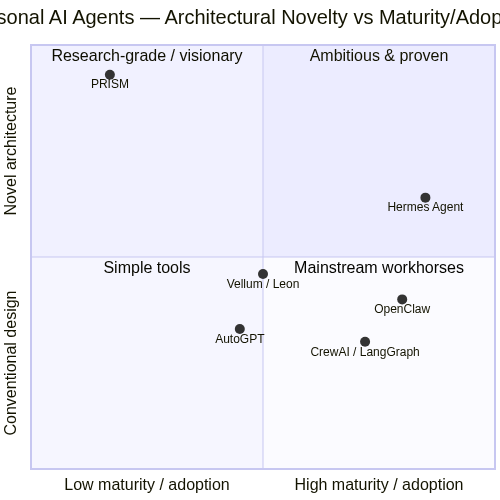
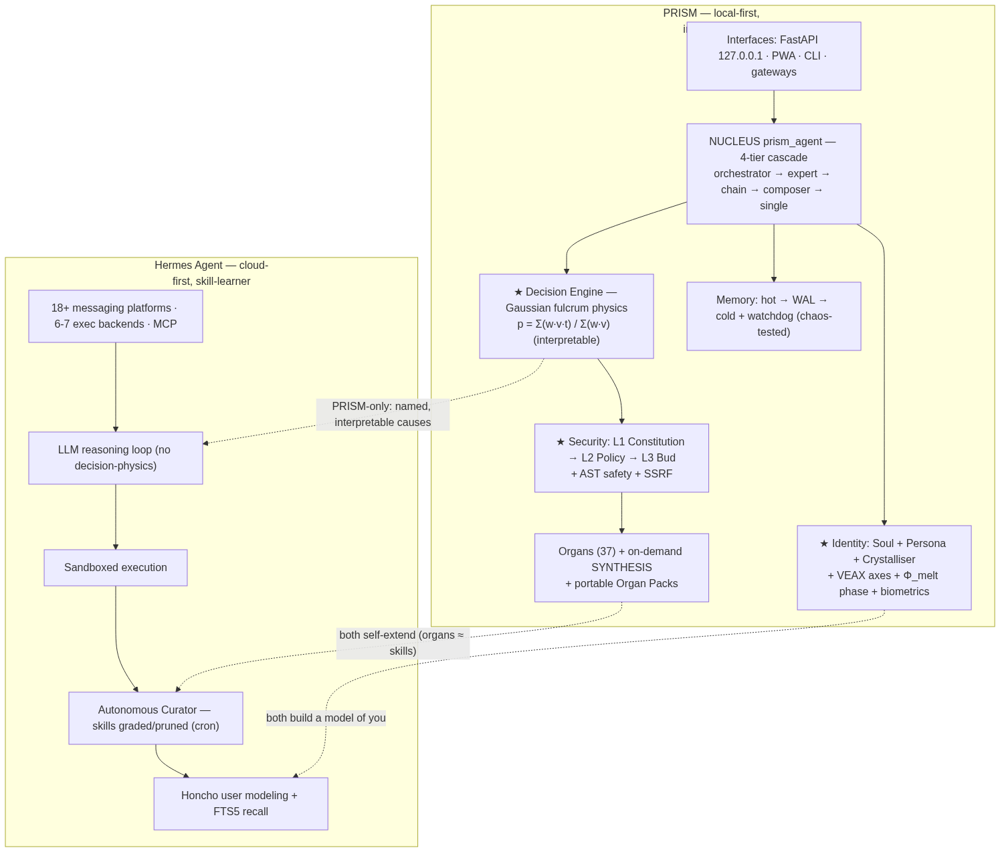

# PRISM — positioning & the Organ Pack share format

## Where PRISM sits



PRISM is the most **architecturally novel** entry in the open personal-AI space
(interpretable Gaussian decision engine, VEAX axes, the Φ_melt phase engine, a
formal L1→L2→L3 capability-security model, cross-domain reasoning) — but the
**least mature** in adoption and ecosystem versus systems like
[Hermes Agent](https://github.com/NousResearch/hermes-agent) and OpenClaw.

## How the stacks compare



Both self-extend (PRISM *organs* ≈ Hermes *skills*) and both build a model of
the user. PRISM's differentiators are **interpretable decisions** and
**local-first sovereignty**; Hermes leads on cloud-native deployment, messaging
breadth, MCP, and proven adoption.

> Diagrams are generated from [`positioning.mmd`](positioning.mmd) and
> [`architecture.mmd`](architecture.mmd). Re-render with mermaid-cli
> (`mmdc -i x.mmd -o x.png`) or any mermaid renderer.

---

## Organ Packs — portable, shareable capability bundles

PRISM's answer to a skills-hub (cf. agentskills.io): bundle one or more organs
into a single, **hash-verified** JSON document that can be exported from one
PRISM instance and imported into another. Implemented in
[`prism_organ_pack.py`](../../prism_organ_pack.py).

**Format** (`prism.organ-pack/v1`): a manifest with `name`, `version`,
`author`, a canonical pack `sha256`, and an `organs` array where every entry
carries its `code` plus a per-organ `sha256`.

**Safety**: importing reuses `OrganLoader.install_bundle`, so every organ still
passes the strict AST safety scan, the capability auditor, and the
critical-capability block. Tampered packs fail the hash check; malicious-but-
well-formed packs are still rejected by static analysis.

### HTTP API

```http
POST /organs/pack/export
{ "intents": ["hacker_news", "currency_convert"],
  "name": "research-tools", "author": "alice", "preview": false }
→ a prism.organ-pack/v1 document (or a code-free summary when preview=true)

POST /organs/pack/import
{ ...pack..., "overwrite": false }
→ { "ok": true, "installed": [...], "skipped": [...], "failed": [...] }
```

### Programmatic

```python
from prism_organ_pack import build_pack, dumps, loads, import_pack

pack = build_pack(loader, ["hacker_news"], name="research-tools", author="alice")
open("research-tools.organpack.json", "w").write(dumps(pack))

# on another machine
report = import_pack(loader, loads(open("research-tools.organpack.json").read()))
```
